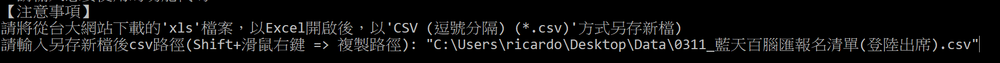

# NTU CARDO 資料庫管理程式 操作指南

### Version 1 程式功能指南

* [活動結束後資料建檔](#活動結束後資料建檔(Version1))

<br>

# 活動結束後資料建檔(Version1)

本區塊功能主要用於活動辦理完成後的資料建檔。依照所準備好的資料，本區塊共有三個不同的功能可供使用協助建檔。

**注意事項：**

**12. 【活動結束後資料建檔】「已登記出席統計表」生成「計算完成統計表」並「輸入資料庫」** 為預設標準流程，平時資料建檔應使用本功能。

```shell
# 【活動結束後資料建檔】
# 10. 【活動結束後資料建檔】「已登記出席統計表」生成「計算完成統計表」（+ 黑名單、CARDO點數、報名方式等)
# 11. 【活動結束後資料建檔】「計算完成統計表」「輸入資料庫」
# 12. 【活動結束後資料建檔】「已登記出席統計表」生成「計算完成統計表」並「輸入資料庫」（標準流程）
```

<br>

### 10. 【活動結束後資料建檔】「已登記出席統計表」生成「計算完成統計表」（+ 黑名單、CARDO點數、報名方式等)

<br>

### 11. 【活動結束後資料建檔】「計算完成統計表」「輸入資料庫」

<br>

### 12. 【活動結束後資料建檔】「已登記出席統計表」生成「計算完成統計表」並「輸入資料庫」（標準流程）

**輸入：已登記出席資料表.csv；輸出：已登記出席資料表.csv_已計算黑名單和CARDO點數.csv、資料庫建檔**

**此功能為本區塊功能預設的標準流程**，將對從台大活動網站下載並轉換成csv檔的**"已登記出席資料表.csv"**，進行**資料清理**及**資料庫輸入**處理；以下為操作方式介紹：

1. **輸入資料庫帳號及密碼**

</img>

2. **輸入"12"，啟動本次欲使用的功能**

</img>

3. **輸入欲進行處理的資料表路徑**

**注意事項：**

* 路徑必須是由兩個「"」所包圍的Windows路徑

</img>